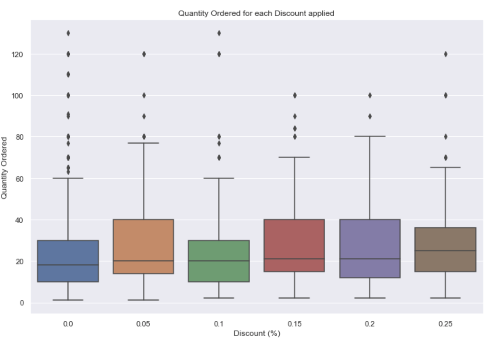

# Module 3 -  Final Project

* Student name: **Dennis Trimarchi**
* Student pace: **Full time**
* Instructor name: **Rafael Carrasco**
* Blog post URL: [https://medium.com/@dtuk81/sql-and-the-northwind-database-c13331f753ff?sk=d3096103c0929f9218712903aa082887]


# Abstract

This notebook contains an analysis of data pertaining to a ficticious company named Northwind. All of the data used in this project comes from the Northwind Database. The data is accessed using SQL queries in python and all other data manipulation and analysis is completed in python jupyter notebooks. Northwind is a company that manages the global sales of various food products between suppliers and customers. A majority of the data is focused on specific orders and the associated order details.

The questions I posed are written below for convenience:

1. Does discount amount have a statistically significant effect on the quantity of a product in an order? If so, at what level(s) of discount?
2. Does discount have a statistically significant effect on average order revenue? i.e. Are we lowering average order revenue when we provide a discount?
3. Does sales representative have a statistically significant effect on order revenue? i.e. Are certain sales reps getting higher average order prices?
4. Does unit price impact how much a customer spends? How about quantity that a customer orders?
5. Do Meat/Poultry products have a statistically significant effect on total order price?

For all tests described in this report, a significance level (alpha) of 0.05 was used.


## Outline

I have broken this notebook out into sections. All of my Python work is completed in other notebooks. In all, I have five notebooks - one jupyter notebook for each question. Links to the respective notebooks are provided in the sections below.

This readme contains sections that summarize the work for each question which include:
* Question Number
* Hypothesis Definition
* Database Query Used
* Results/Visualizations
* Conclusions/Recommendations

-------

<details><summary>Question 1</summary>

## Question 1
Does discount amount have a statistically significant effect on the quantity of a product in an order? If so, at what level(s) of discount?
What discount level matters the most?

### Hypothesis
* **Ho:** There is no difference in the mean product quantity ordered between customers who received a discount and those who did not receive a discount.
* **Ha:** The mean product quantity ordered for those who received a discount will be greater than the mean product quantity ordered by customers who did not receive a discount. i.e. mean quantity for discounted > 21.72

### Database Query Used
The following query was used to obtain the base set of data. It is a simple full-table query as all of the relevant data is available in the OrderDetail table.
```
    SELECT *
    FROM OrderDetail
```

### Results / Visualizations

#### Box Plot
The distribution of order quantities for each discount level are shown. There are some differences that can be seen.



#### Tukey Test
The Tukey test shows where there are statistically significant differences in quantity for each discount level. Group1 in the table represents full price (0.00 discount) and Group2 represents each of the other discount levels. The **Null Hypothesis is rejected in all discount levels with the exception of 0.10.**


#### Effect Size
The following table shows the statistically significant discount levels, and their mean difference and effect size with respect to the full price group.

|Discount | Mean Difference | Effect Size |
|---------|-----------------|-------------|
| 0.05    |    6.29         |     0.347   |
| 0.15    |    6.66         |     0.372   |
| 0.20    |    5.30         |     0.300   |
| 0.25    |    6.52         |     0.367   |


### Conclusions / Recommendations
Discount levels of 0.05, 0.15, 0.20, 0.25 have a statistically significant correlation with quantity ordered.

The ranked discount levels by effect size are: 15%, 25%, 5%, 20%. However, in all cases the effect is small to medium (between 0.2 and 0.5).

For discount levels of 1%, 2%, 3%, 4%, 6%, there was not enough data. For discount level of 10%, there was not a statistically significant correlation to quantity ordered.

Based on these results I would recommend that the company avoid giving 10% discounts as they do not impact order quantity and therefore represent a loss of 10% revenue.

I would also would also ask the company to consider that 15% discounts have a greater effect on quantity ordered than 20%, and 25% discounts.

Depending on inventory, product expiration, etc, there are instances where increasing quantity of product per order is beneficial. In these instances, 15% and 25% discount levels would have the greatest effect.

*Details in Jupyter Notebook: [Question1.ipynb](Question1.ipynb)*

</details>

-------

<details><summary>Question 2</summary>

## Question 2
Does discount have a statistically significant effect on average order revenue? i.e. Are we lowering average order revenue when we provide a discount?

### Hypothesis
* **Ho:** There is no difference in the mean total revenue per order between customers who received a discount and those who did not receive a discount.
* **Ha:** The mean total revenue per order for those who received a discount will be significantly different than the mean total revenue per order by customers who did not receive a discount. i.e. mean revenue per order for discounted != 570.01. - Two tailed

### Database Querys Used
The following query was used to obtain the base set of data. The price per order (TotalPrice) is feature engineered through the SQL Query. I did not group the individual line items within an order because for some orders, individual line items are discounted while others are not. This means that for this test, individual product line items within an order are being evaluated as an "order".

Data to be analyzed:

```
    SELECT *, UnitPrice * Quantity * (1-Discount) AS TotalPrice
    FROM OrderDetail
```

Summary Data for information purposes:
```
    SELECT Discount,
           Round(avg(UnitPrice * Quantity * (1-Discount)),2) AS AvgPrice,
           Round(min(UnitPrice * Quantity * (1-Discount)),2) AS MinPrice,
           Round(max(UnitPrice * Quantity * (1-Discount)),2) AS MaxPrice,
           count(*) AS NumOrders
    FROM OrderDetail
    GROUP BY Discount
```

### Results / Visualizations

#### Summary Stats


#### Box Plot
The distribution of Total Revenue per Order for each discount level are shown. There are some differences that can be seen.


#### Tukey Test
The Tukey test below shows which discount levels have a statistically significant impact on order revenue. Group1 in the table represents full price (0.00 discount) and Group2 represents each of the other discount levels. **The Null Hypothesis is rejected for the 0.05 discount level. For all other discount levels, the Null Hypothesis fails to be rejected.** The Null Hypothesis was also rejected for the 0.05 discount level with a Welch's t-test.


#### Effect Size
The following table shows the 5% discount level, mean difference and effect size with respect to the full price group.

|Discount | Mean Difference | Effect Size |
|---------|-----------------|-------------|
| 0.05    |    227.92       |     0.221   |

This was a two-tailed test, but we can see that the mean revenue is greater for the 5% discount level. The effect of the discount is small according to Cohen's d effect size measurement.

### Conclusions / Recommendations

Discount has a statistically significant correlation with order revenue for the 5% discount level. For all other discount levels, the Null Hypothesis failed to be rejected.

Based on these results I would recommend that the company consider that a 5% discount results in greater revenue per order.

This may be due to a combination of the customer ordering more product because of the presence of the discount, and the discount being small enough to limit negative impact to revenue. Further investigation and experimentation would be interesting.

Additionally, this test shows that applying a discount does not negatively correlate with average order revenue.

*Details in Jupyter Notebook: [Question2.ipynb](Question2.ipynb)*

</details>

-------

<details><summary>Question 3</summary>

## Question 3
Does sales representative have a significant effect on order revenue? i.e. Are certain sales reps getting higher average order prices?

This may provide insight into which sales reps are pushing for higher dollar orders/products vs. quantity of orders. The results may provide valueable information to management about rewards systems - quanity/quality of a sale. Also to help figure out who may be undervalued in the organization.

### Hypothesis
* **Ho:** There is no difference in the mean order revenue for different sales representatives.
* **Ha:** The sales representative will have an effect on the mean order revenue. i.e. there will be a statistically significant difference in mean order revenue for at least one sales rep and his/her peers. -two-tailed test

### Database Query Used
The following query was used to obtain the base set of data. The total order price (TotalPrice) is feature engineered through the SQL Query. In this case, since we are concerned with employees, the TotalPrice is aggregated across the entire order (specific product line items within an order are not relevant).

Data to be analyzed:
```
    SELECT EmployeeId, LastName, FirstName, od.OrderId,
           count(od.OrderId) AS ProductsPerOrder,
           sum(od.UnitPrice * od.Quantity * (1-od.Discount)) AS TotalPrice
    FROM OrderDetail od
    JOIN 'Order' o ON o.Id=od.OrderId
    JOIN Employee e ON e.Id=o.EmployeeId
    GROUP BY od.OrderId
```

Summary Data for information purposes:
```
    SELECT EmployeeId, LastName, FirstName,
           count(DISTINCT od.OrderId) AS NumOrders,
           sum(od.UnitPrice * od.Quantity * (1-od.Discount)) AS TotalSales
    FROM OrderDetail od
    JOIN 'Order' o ON o.Id=od.OrderId
    JOIN Employee e ON e.Id=o.EmployeeId
    GROUP BY EmployeeId
```

### Results / Visualizations

#### Summary Stats
Here is a breakdown of the total sales and total revenue for each sales representative. At first glance, it would appear that there are some major differences between sales rep effectiveness. But how do they compare on an individual order by order basis?


#### Box Plot
The distribution of Total Order Price for each employee is shown. There are some differences that can be seen.


#### ANOVA Test
The ANOVA test for Sales Representative shows that we **fail to reject the Null Hypothesis**.

| .                | sum_sq        |   df    |     F    |  PR(>F)   | reject_null |
|------------------|---------------|---------|----------|-----------|-------------|
|C(LastName)       | 4.251645e+06  |  8.0    | 0.451587 | 0.889831  |     False   |
| Residual         | 9.297212e+08  | 790.0   |   NaN    |    NaN    |    False    |

The pairwise Tukey test for all employees also failed to reject the Null Hypothesis for any combination. This table is in my jupyter notebook (there are 36 pairwise combinations of employees.)


### Conclusions / Recommendations
Failed to find a statstically significant correlation between sales representative and order price.

Even though some of the employees have a higher number of orders and higher Total Revenue, their order prices remain similar. No one employee stands out here. The difference in total sales per employee is being driven by number of orders instead of average order revenue.

This can indicate many things. There may be a general lack of relationship between sales representatives and customers which would remove any impact individuals might have on the sales process. It could indicate that standardization among the sales process overrides any independent action of the salesperson. It could be that order price is determined by market factors. It could also be coincidental.

*Details in Jupyter Notebook: [Question3.ipynb](Question3.ipynb)*

</details>

-------

<details><summary>Question 4</summary>

## Question 4
Does unit price impact how much a customer spends? How about quantity that a customer orders?

Customers may buy higher quantities when unit price is low, or conversely purchase lower quantities when unit price is high. If this is the case, revenue per order may not be significantly different. If quantity is not impacted by unit price, then revenue per order should be positively correlated with unit price.

### Hypotheses
Revenue:
* **Ho:** There is no difference in the mean order revenue for products of different unit prices.
* **Ha:** The mean order revenue will be greater for products with higher unit prices. -one tailed test

Quantity:
* **Ho:** There is no difference in quantity of a product ordered for products of different unit prices.
* **Ha:** The quantity ordered will be higher for products with lower unit prices. -one tailed test

### Database Query Used
The following query was used to get the base set of data. The price per order by (TotalPrice) is feature engineered through the SQL Query.
```
    SELECT od.Id, o.CustomerId, od.UnitPrice, od.Quantity,
           od.UnitPrice * od.Quantity * (1-od.Discount) AS TotalPrice
    FROM OrderDetail od
    JOIN 'Order' o ON o.Id=od.OrderId
```

### Results / Visualizations
The data was divided into 4 groups each representing a quartile of orders based on unit price.

#### Total Order Revenue
##### Box Plot
The distribution of Total Order Revenue for each Unit Price quartile is shown below. There appears to be clear difference in order price for each group.


##### ANOVA Test
The ANOVA test for Unit Price Quartile with respect to Order Revenue shows that we **reject the Null Hypothesis**.

| .                   | sum_sq        |   df    |     F      |  PR(>F)        | reject_null |
|---------------------|---------------|---------|------------|----------------|-------------|
|C(UnitPriceQuartile) | 2.300110e+08  |  3.0    | 296.780187 | 5.381406e-161  |     True    |
| Residual            | 5.510402e+08  | 2133.0  |   NaN      |    NaN         |    N/A      |

The pairwise Tukey Test for all combinations also rejected the Null Hypothesis. This table is in my jupyter notebook.

##### Effect Size
The following table shows the mean difference and effect size for each quartile with respect to the remaining data.

|Unit Price Quartile | Mean Difference | Effect Size |
|--------------------|-----------------|-------------|
| 0-25               |    469.98       |     0.826   |
| 25-50              |    226.90       |     0.380   |
| 50-75              |    21.42        |     0.035   |
| 75-100             |    705.28       |     1.345   |


#### Quantity Per Order
##### Box Plot
The distribution of Quantity per order for each Unit Price quartile is shown below. For each group, the quantity per order looks to be fairly consistent.


##### ANOVA Test
The ANOVA test for Unit Price Quartile with respect to Order Quantity shows that we **fail to reject the Null Hypothesis**.

| .                   | sum_sq        |   df    |     F      |  PR(>F)        | reject_null |
|---------------------|---------------|---------|------------|----------------|-------------|
|C(UnitPriceQuartile) | 745.434750    |  3.0    | 0.714806   | 0.543094       |    False    |
| Residual            | 741465.475872 | 2133.0  |   NaN      |    NaN         |    N/A      |

The pairwise Tukey Test for all combinations also failed to reject the Null Hypothesis. This table is in my jupyter notebook.


### Conclusions / Recommendations

Quantity per order is pretty consistent across different product price levels. The Null Hypothesis failed to be rejected indicating no statistically significant difference in quantity for different unit prices.

However, revenue per order increases with increased unit price. The Null Hypothesis was rejected indicating there is a statistically significant difference in order revenue for different unit prices.

This is interesting because it indicates that customers do not order different quantities when the unit price is higher. There may be a customer preference for certain quantities regardless of price (possibly for inventory reasons). A supplier might be able to get away with a small price increase without impacting sales. Perhaps a supplier could look into adjusting their product quantity/volume per unit in order to increase sales (i.e re-defining their sale unit).

*Details in Jupyter Notebook: [Question4.ipynb](Question4.ipynb)*

</details>

-------

<details><summary>Question 5</summary>

## Question 5
Do Meat/Poultry products have a statistically significant effect on total order price?

### Hypothesis
* **Ho:** There is no statistical difference in mean Total Order Price for Meat/Poultry orders.
* **Ha:** The mean total order price will be statistically different for Meat/Poultry orders vs other product categories.

### Database Query Used
The following query was used to get the base set of data. The price per order (TotalOrderPrice) is feature engineered through the SQL Query.
```
    SELECT od.OrderId, od.UnitPrice, od.Quantity,
           od.UnitPrice * od.Quantity * (1-od.Discount) AS TotalOrderPrice,
           ProductName, CategoryName
    FROM 'Order' o
    JOIN OrderDetail od ON o.Id=od.OrderId
    JOIN Product p ON p.Id=od.ProductId
    JOIN Category c ON c.Id=p.CategoryId
```

### Results / Visualizations

#### Box Plot
The distribution of Total Order Price for each Product Category is shown below. There appear to differences among the different groups. In particular, Meat/Poultry, Produce, and Dairy Products have higher order prices.


#### Tukey Test and Effect Size
The Tukey Test with Effect Size is shown below for all comparisons involving Meat/Poultry. We can **reject the Null Hypothesis for all comparisons except for Produce**.


### Conclusions / Recommendations
Meat/Poultry has a statistically higher average order price than every other product category with the exception of Produce. In particular it has the largest effect difference from Beverages and Seafood categories.

Meat and Poultry bring in higher revenue per order. Increasing the meat and poultry product offering could have a greater impact on company revenue. Similarly, seeking new customers who are interested in buying meat and poultry products would be a good move to increase average order revenues.

*Details in Jupyter Notebook: [Question5.ipynb](Question5.ipynb)*

</details>
